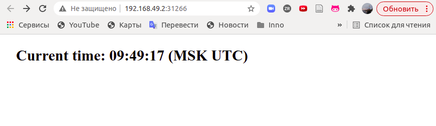
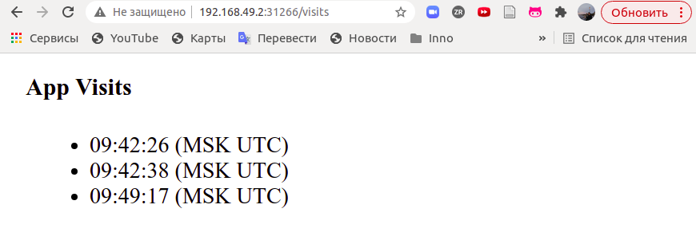

# K8s StatefulSet

`kubectl get po,sts,svc,pvc` command output

```bash
NAME               READY   STATUS    RESTARTS   AGE
pod/app-python-0   1/1     Running   0          10m
pod/app-python-1   1/1     Running   0          10m
pod/app-python-2   1/1     Running   0          10m

NAME                          READY   AGE
statefulset.apps/app-python   3/3     10m

NAME                         TYPE           CLUSTER-IP      EXTERNAL-IP   PORT(S)          AGE
service/app-python-service   LoadBalancer   10.111.203.62   <pending>     5000:31266/TCP   10m
service/kubernetes           ClusterIP      10.96.0.1       <none>        443/TCP          21d

NAME                                               STATUS   VOLUME                                     CAPACITY   ACCESS MODES   STORAGECLASS   AGE
persistentvolumeclaim/visits-volume-app-python-0   Bound    pvc-29dd85e7-360f-462c-8d77-0188c7cc9929   128M       RWO            standard       10m
persistentvolumeclaim/visits-volume-app-python-1   Bound    pvc-f4907cab-4f64-4b37-bf6c-c77e9f7af21d   128M       RWO            standard       10m
persistentvolumeclaim/visits-volume-app-python-2   Bound    pvc-ccdafa02-3f2a-4ead-82e8-977306b29ede   128M       RWO            standard       10m
```

App is running:




`kubectl exec pod/app-python-0 -- cat cache/visits.txt` command output

```bash
09:42:30
09:46:01
09:47:55
09:47:57
```

`kubectl exec pod/app-python-1 -- cat cache/visits.txt` command output

```bash
09:42:33
09:45:39
09:45:41
09:46:56
09:47:38
09:47:40
09:47:52
```

`kubectl exec pod/app-python-2 -- cat cache/visits.txt` command output

```bash
09:42:26
09:42:38
09:49:17
```

Here we can notice that the pods' outputs are different. That happens because of the different separate volumes for each pod specified in the `volumeClaimTemplates`. By `ReadWriteOnce` option I specified that the storage could be accessed and modified by the one and only node. While in deployment the single storage was used for all the pods, that could cause some access issues.

Also, for our app ordering guarantee are unnecessary, cause the pods are separate and independent. They do not communicate or have some common storage to access, therefore could be run in parallel(`podManagementPolicy: "Parallel"`).
