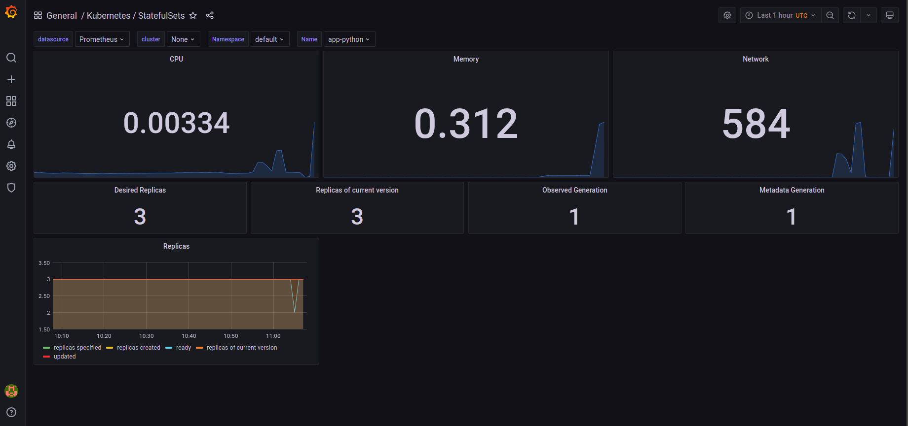
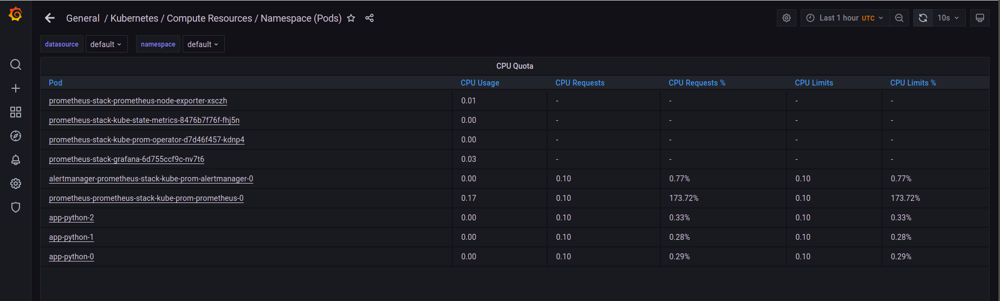
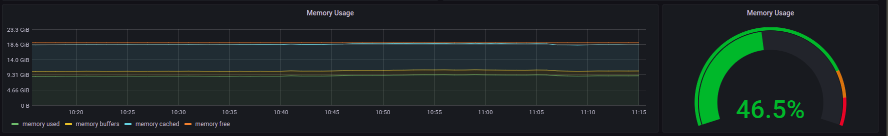
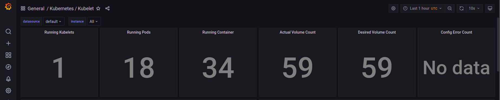
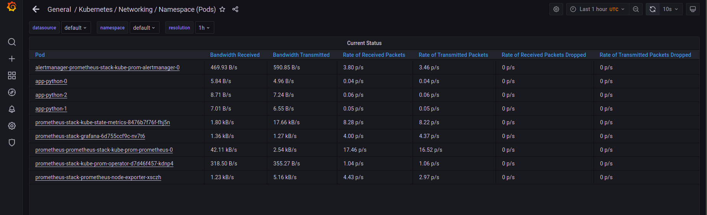
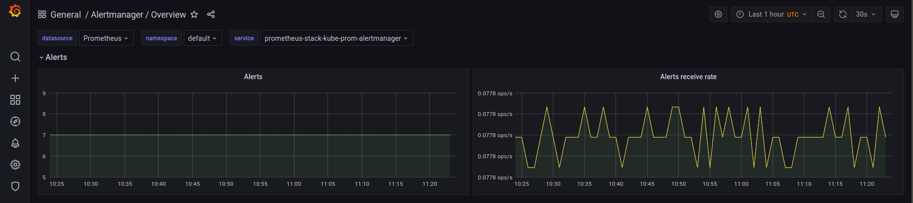
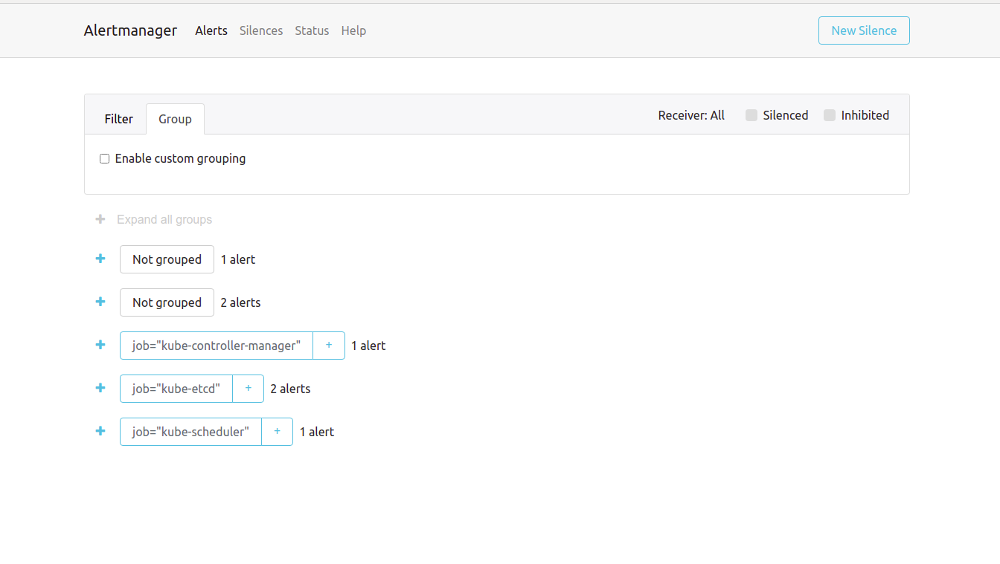

# K8s Prometheus Stack and Init Containers

## Components of the Kube Prometheus

- The Prometheus Operator - automates Prometheus monitoring stack configuration and deployment
- Highly available Prometheus - metric collection and managing tool
- Highly available Alertmanager - alerts management tool for the Prometheus server
- Prometheus node-exporter - hardware and OS metrics collector and exporter for node monitoring
- Prometheus Adapter for Kubernetes Metrics APIs - Kubernetes resource, custom, and external metrics adapter for Prometheus
- kube-state-metrics - Kubernates objects state metrics provider
- Grafana - user-friendly dashboards for the data, metrics and analytics

## Cluster Status

`kubectl get po,sts,svc,pvc,cm` command output after Kube Prometheus Stack installation

```bash
NAME                                                         READY   STATUS    RESTARTS   AGE
pod/alertmanager-prometheus-stack-kube-prom-alertmanager-0   2/2     Running   0          38m
pod/app-python-0                                             1/1     Running   0          3h
pod/app-python-1                                             1/1     Running   0          3h
pod/app-python-2                                             1/1     Running   0          3h
pod/prometheus-prometheus-stack-kube-prom-prometheus-0       2/2     Running   0          38m
pod/prometheus-stack-grafana-6d755ccf9c-nv7t6                2/2     Running   0          41m
pod/prometheus-stack-kube-prom-operator-d7d46f457-kdnp4      1/1     Running   0          41m
pod/prometheus-stack-kube-state-metrics-8476b7f76f-fhj5n     1/1     Running   0          41m
pod/prometheus-stack-prometheus-node-exporter-xsczh          1/1     Running   0          41m

NAME                                                                    READY   AGE
statefulset.apps/alertmanager-prometheus-stack-kube-prom-alertmanager   1/1     38m
statefulset.apps/app-python                                             3/3     3h
statefulset.apps/prometheus-prometheus-stack-kube-prom-prometheus       1/1     38m

NAME                                                TYPE           CLUSTER-IP       EXTERNAL-IP   PORT(S)                      AGE
service/alertmanager-operated                       ClusterIP      None             <none>        9093/TCP,9094/TCP,9094/UDP   38m
service/app-python-service                          LoadBalancer   10.111.203.62    <pending>     5000:31266/TCP               3h
service/kubernetes                                  ClusterIP      10.96.0.1        <none>        443/TCP                      21d
service/prometheus-operated                         ClusterIP      None             <none>        9090/TCP                     38m
service/prometheus-stack-grafana                    ClusterIP      10.108.126.230   <none>        80/TCP                       41m
service/prometheus-stack-kube-prom-alertmanager     ClusterIP      10.109.123.233   <none>        9093/TCP                     41m
service/prometheus-stack-kube-prom-operator         ClusterIP      10.102.241.14    <none>        443/TCP                      41m
service/prometheus-stack-kube-prom-prometheus       ClusterIP      10.99.8.142      <none>        9090/TCP                     41m
service/prometheus-stack-kube-state-metrics         ClusterIP      10.102.30.228    <none>        8080/TCP                     41m
service/prometheus-stack-prometheus-node-exporter   ClusterIP      10.96.2.99       <none>        9100/TCP                     41m

NAME                                               STATUS   VOLUME                                     CAPACITY   ACCESS MODES   STORAGECLASS   AGE
persistentvolumeclaim/visits-volume-app-python-0   Bound    pvc-29dd85e7-360f-462c-8d77-0188c7cc9929   128M       RWO            standard       3h
persistentvolumeclaim/visits-volume-app-python-1   Bound    pvc-f4907cab-4f64-4b37-bf6c-c77e9f7af21d   128M       RWO            standard       3h
persistentvolumeclaim/visits-volume-app-python-2   Bound    pvc-ccdafa02-3f2a-4ead-82e8-977306b29ede   128M       RWO            standard       3h

NAME                                                                     DATA   AGE
configmap/app-python-config                                              1      3h
configmap/kube-root-ca.crt                                               1      21d
configmap/prometheus-prometheus-stack-kube-prom-prometheus-rulefiles-0   28     38m
configmap/prometheus-stack-grafana                                       1      41m
configmap/prometheus-stack-grafana-config-dashboards                     1      41m
configmap/prometheus-stack-grafana-test                                  1      41m
configmap/prometheus-stack-kube-prom-alertmanager-overview               1      41m
configmap/prometheus-stack-kube-prom-apiserver                           1      41m
configmap/prometheus-stack-kube-prom-cluster-total                       1      41m
configmap/prometheus-stack-kube-prom-controller-manager                  1      41m
configmap/prometheus-stack-kube-prom-etcd                                1      41m
configmap/prometheus-stack-kube-prom-grafana-datasource                  1      41m
configmap/prometheus-stack-kube-prom-k8s-coredns                         1      41m
configmap/prometheus-stack-kube-prom-k8s-resources-cluster               1      41m
configmap/prometheus-stack-kube-prom-k8s-resources-namespace             1      41m
configmap/prometheus-stack-kube-prom-k8s-resources-node                  1      41m
configmap/prometheus-stack-kube-prom-k8s-resources-pod                   1      41m
configmap/prometheus-stack-kube-prom-k8s-resources-workload              1      41m
configmap/prometheus-stack-kube-prom-k8s-resources-workloads-namespace   1      41m
configmap/prometheus-stack-kube-prom-kubelet                             1      41m
configmap/prometheus-stack-kube-prom-namespace-by-pod                    1      41m
configmap/prometheus-stack-kube-prom-namespace-by-workload               1      41m
configmap/prometheus-stack-kube-prom-node-cluster-rsrc-use               1      41m
configmap/prometheus-stack-kube-prom-node-rsrc-use                       1      41m
configmap/prometheus-stack-kube-prom-nodes                               1      41m
configmap/prometheus-stack-kube-prom-persistentvolumesusage              1      41m
configmap/prometheus-stack-kube-prom-pod-total                           1      41m
configmap/prometheus-stack-kube-prom-prometheus                          1      41m
configmap/prometheus-stack-kube-prom-proxy                               1      41m
configmap/prometheus-stack-kube-prom-scheduler                           1      41m
configmap/prometheus-stack-kube-prom-statefulset                         1      41m
configmap/prometheus-stack-kube-prom-workload-total                      1      41m
```

## Cluster Information

1. Check how much CPU and Memory your StatefulSet is consuming.
   - 0.00334 CPU, 0.312 Memory

   

2. Check which Pod is using CPU more than others and which is less in the default namespace.
   - `prometheus-prometheus-stack-kube-prom-prometheus-0` is using more
   - `prometheus-stack-kube-prom-operator-d7d46f457-kdnp4` and `prometheus-stack-kube-state-metrics-8476b7f76f-fhj5n` - less

   

3. Check how much memory is used on your node, in % and mb.
   - 46.5% or 9.31 GiB

   

4. Check how many pods and containers actually ran by the Kubelet service.
   - 18 pods and 34 containers

   

5. Check which Pod is using network more than others and which is less in the default namespace.
   - `prometheus-prometheus-stack-kube-prom-prometheus-0` is using more
   - `app-python-0` - less

   

6. Check how many alerts you have.
   - 7 alerts

   

   Also we can see them in the Web UI on `localhost:9093` by the `kubectl port-forward alertmanager-prometheus-stack-kube-prom-alertmanager-0 9093`.

   

## Init Containers

`kubectl exec app-python-0 -- cat /app-python/container/index.html` command output

```bash
Defaulted container "app-python" out of: app-python, init-container (init)
<html><head></head><body><header>
<title>http://info.cern.ch</title>
</header>

<h1>http://info.cern.ch - home of the first website</h1>
<p>From here you can:</p>
<ul>
<li><a href="http://info.cern.ch/hypertext/WWW/TheProject.html">Browse the first website</a></li>
<li><a href="http://line-mode.cern.ch/www/hypertext/WWW/TheProject.html">Browse the first website using the line-mode browser simulator</a></li>
<li><a href="http://home.web.cern.ch/topics/birth-web">Learn about the birth of the web</a></li>
<li><a href="http://home.web.cern.ch/about">Learn about CERN, the physics laboratory where the web was born</a></li>
</ul>
</body></html>
```
