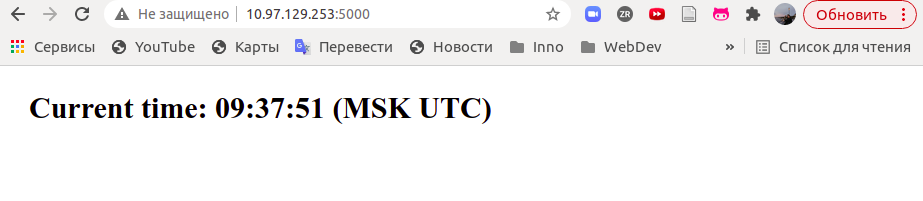
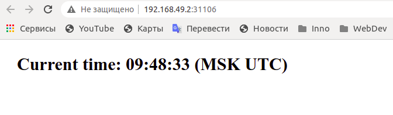
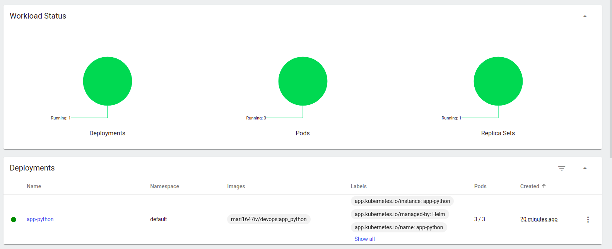
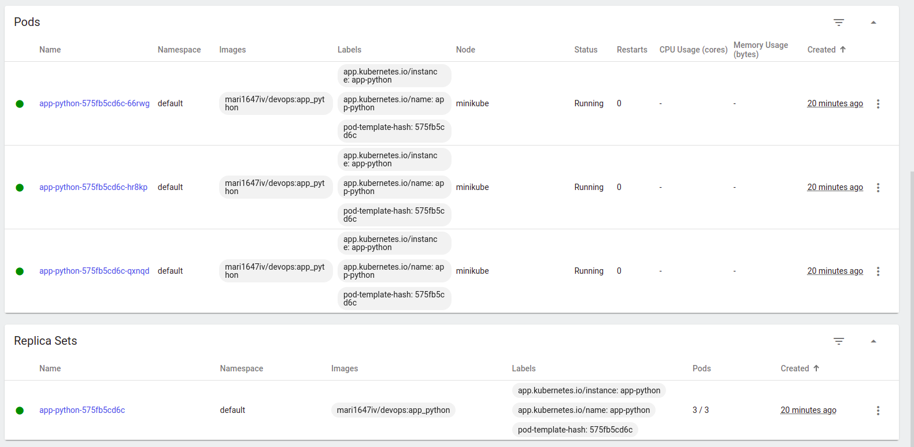

# Kubernetes Report

## Manual deployment

`kubectl get pods, svc` command output

```bash
NAME                                   READY   STATUS    RESTARTS   AGE
pod/app-python-node-6d479d56c5-qtj58   1/1     Running   0          62m

NAME                      TYPE           CLUSTER-IP       EXTERNAL-IP   PORT(S)          AGE
service/app-python-node   LoadBalancer   10.110.138.215   <pending>     8080:31448/TCP   41m
service/kubernetes        ClusterIP      10.96.0.1        <none>        443/TCP          85m
```

## Configuration files deployment

`kubectl get pods, svc` command output

```bash
NAME                                         READY   STATUS    RESTARTS   AGE
pod/app-python-deployment-5dcf7fc74d-d6qtq   1/1     Running   0          103s
pod/app-python-deployment-5dcf7fc74d-vb4bw   1/1     Running   0          103s
pod/app-python-deployment-5dcf7fc74d-vrrbg   1/1     Running   0          103s

NAME                         TYPE           CLUSTER-IP    EXTERNAL-IP   PORT(S)          AGE
service/app-python-service   LoadBalancer   10.99.45.35   <pending>     5000:31590/TCP   3s
service/kubernetes           ClusterIP      10.96.0.1     <none>        443/TCP          10h
```

## HELM deployment

Result



`minikube service app-python` command output

```bash
|-----------|------------|-------------|---------------------------|
| NAMESPACE |    NAME    | TARGET PORT |            URL            |
|-----------|------------|-------------|---------------------------|
| default   | app-python | http/5000   | http://192.168.49.2:31106 |
|-----------|------------|-------------|---------------------------|
🎉  Opening service default/app-python in default browser...
```



Workload page on Minikube dashboard:




`kubectl get pods, svc` command output

```bash
NAME                              READY   STATUS    RESTARTS   AGE
pod/app-python-575fb5cd6c-66rwg   1/1     Running   0          13m
pod/app-python-575fb5cd6c-hr8kp   1/1     Running   0          13m
pod/app-python-575fb5cd6c-qxnqd   1/1     Running   0          13m

NAME                 TYPE           CLUSTER-IP      EXTERNAL-IP     PORT(S)          AGE
service/app-python   LoadBalancer   10.97.129.253   10.97.129.253   5000:31106/TCP   13m
service/kubernetes   ClusterIP      10.96.0.1       <none>          443/TCP          12h
```
