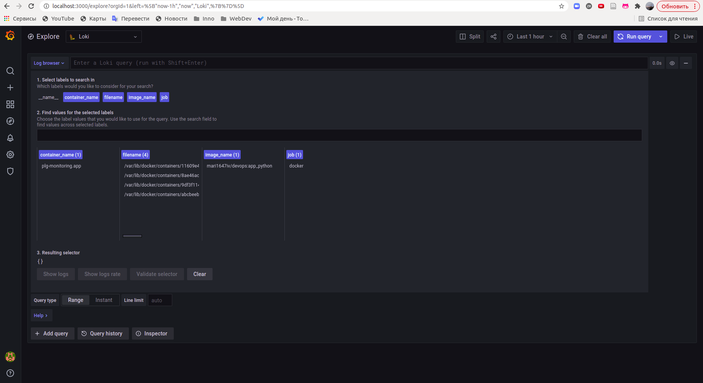
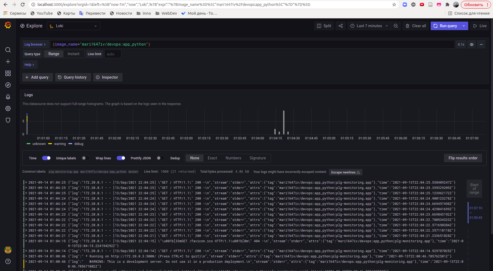
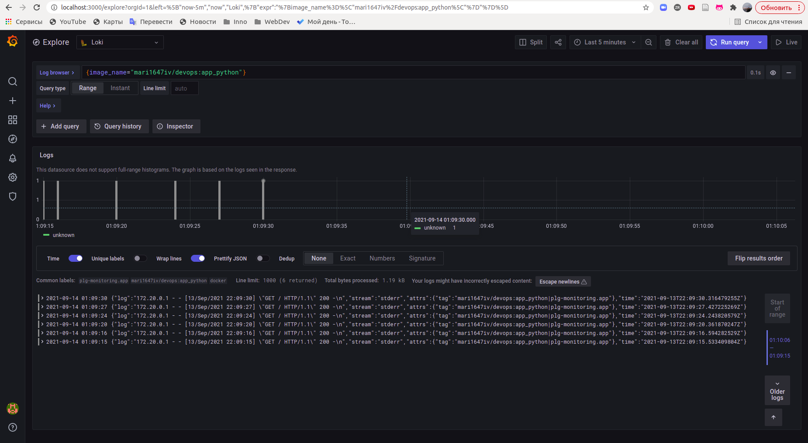
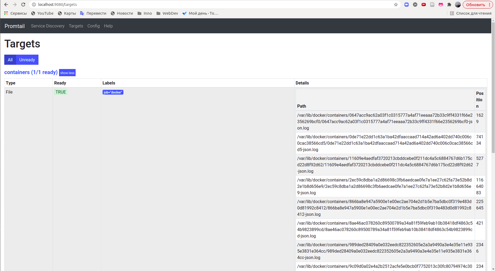
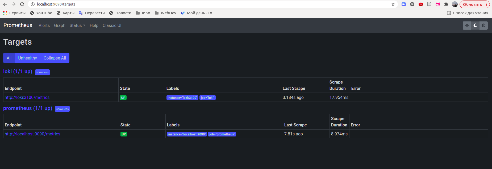
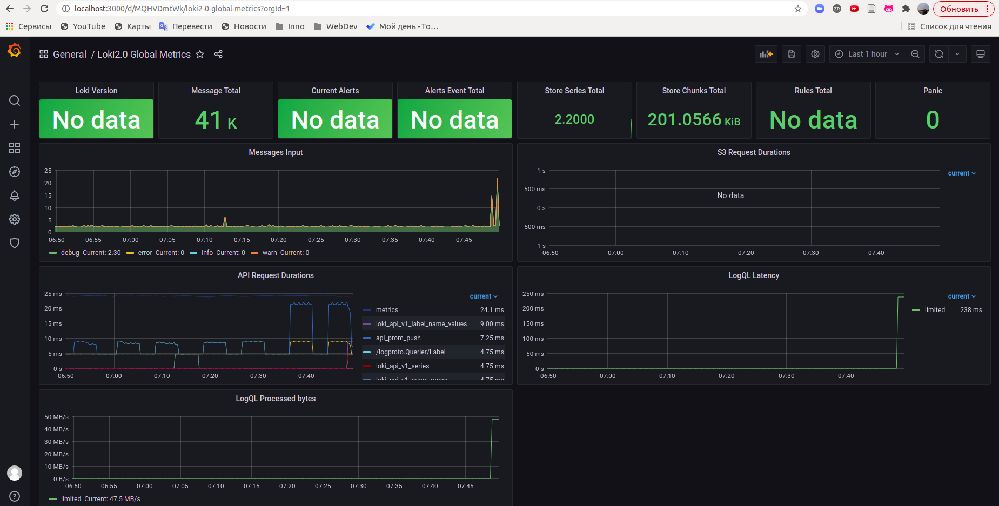
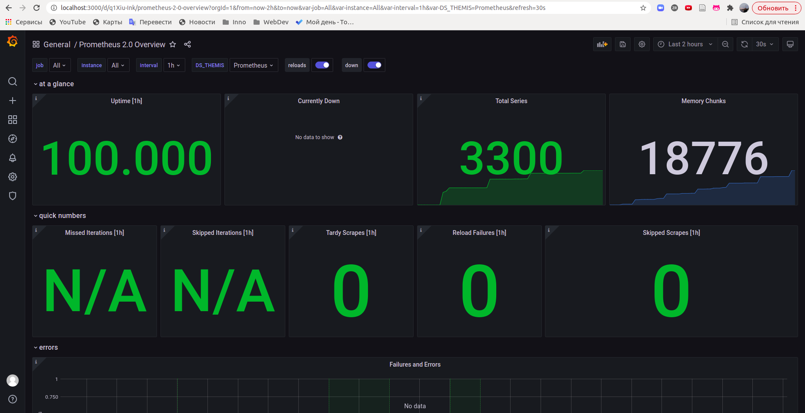

# Monitoring: Logging & Metrics

## PLG Stack

In this lab I implemented the PLG logging stack: `Promtail - Loki - Grafana`. Configurations and docker-compose were partially inspired by Yaroslav O Golub's [repo](https://github.com/blackrosary/loki-nginx).

To run the stack use

```bash
docker-compose up
```

or

```bash
docker-compose up -d
```

to run it in detached mode.

## Lab 7 Results






## Best Practices

### Loki

- Use Static Labels
- Use Dynamic Labels Sparingly
- Label Values Must Always Be Bounded
- Fewer labels => smaller index = better performance
- Be Aware of Dynamic Labels Applied by Clients
- Configure Caching
- Logs Must Be in Increasing Time Order per Stream
- Use `chunk_target_size`
- Use `-print-config-stderr` or `log-config-reverse-order`

### Grafana

- A dashboard should tell a story or answer a question
- Dashboards should reduce cognitive load, not add to it
- Have a monitoring strategy and write it down
- Use the USE, REd, and The Four Golden Signals methods to choose what to monitor
- When creating a new dashboard, make sure it has a meaningful name
- Avoid unnecessary dashboard refreshing to reduce the load on the network or backend
- Use the left and right Y-axes when displaying time series with different units or ranges
- Add documentation to dashboards and panels
- Reuse your dashboards and enforce consistency by using templates and variables
- Avoid dashboard sprawl, meaning the uncontrolled growth of dashboards
- Do not copy dashboards with no significant changes
- When you must copy a dashboard, clearly rename it and do not copy the dashboard tags
- Maintain a dashboard of dashboards or cross-reference dashboards

## Metrics

Lab 8 was focused on the metrics obtaining and the Prometheus tool. You can see the results of this lab below.

## Lab 8 Results




